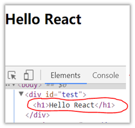
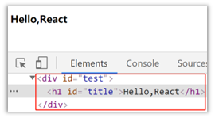
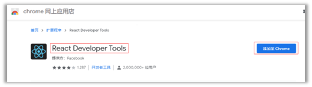
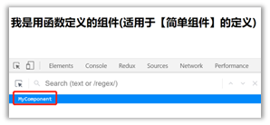
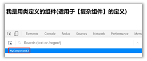

# React


# 1 React入门

## 1.1 React简介

### 1.1.1 官网

1. 英文官网:[ https://reactjs.org/](https://reactjs.org/)

2. 中文官网: https://react.docschina.org/


***

### 1.1.1 介绍描述

1. 用于动态构建用户界面的 JavaScript 库(只关注于视图)

2. 由Facebook开源


***

### 1.1.2 React的特点

1. 声明式编码

2. 组件化编码

3. React Native 编写原生应用

4. 高效（优秀的Diffing算法）


***

### 1.1.3 React高效的原因

1. 使用虚拟(virtual)DOM, 不总是直接操作页面真实DOM。

2. DOM Diffing算法, 最小化页面重绘。


***

## 1.2 React的基本使用

### 1.2.1. 效果




***

### 1.2.2 相关js库

1. react.js：React核心库。
2. react-dom.js：提供操作DOM的react扩展库。
3. babel.min.js：解析JSX语法代码转为JS代码的库。


***

### 1.2.3 创建虚拟DOM的两种方式



1. 纯JS方式(一般不用)
2. JSX方式


***

### 1.2.4 虚拟DOM与真实DOM

1. React提供了一些API来创建一种 “特别” 的一般js对象
   - ```const VDOM = React.createElement('xx',{id:'',},xx)```
   - l 上面创建的就是一个简单的虚拟DOM对象
2. 虚拟DOM对象最终都会被React转换为真实的DOM
3. 我们编码时基本只需要操作react的虚拟DOM相关数据, react会转换为真实DOM变化而更新界。


***

## 1.3  React JSX

### 1.3.1 效果


***

### 1.1.2 JSX

1. 全称: JavaScript XML

2. react定义的一种类似于XML的JS扩展语法: JS + XML本质是

   ```React.createElement(component, props, ...children)```方法的语法糖

3. 作用: 用来简化创建虚拟DOM 

   - 写法：```var ele = <h1>Hello JSX!</h1>```
   - 注意1：它不是字符串, 也不是HTML/XML标签
   - 注意2：它最终产生的就是一个JS对象

4. 标签名任意: HTML标签或其它标签

5. 标签属性任意: HTML标签属性或其它

6. 基本语法规则

   - 遇到 <开头的代码, 以标签的语法解析: html同名标签转换为html同名元素, 其它标签需要特别解析
   - 遇到以 { 开头的代码，以JS语法解析: 标签中的js表达式必须用{ }包含

7. babel.js的作用

   - 浏览器不能直接解析JSX代码, 需要babel转译为纯JS的代码才能运行
   - 只要用了JSX，都要加上type="text/babel", 声明需要babel来处理

   

***

### 1.3.3 渲染虚拟DOM(元素)

1. 语法: ```ReactDOM.render(virtualDOM, containerDOM)```
2. 作用: 将虚拟DOM元素渲染到页面中的真实容器DOM中显示
3. 参数说明
   - 参数一: 纯js或jsx创建的虚拟dom对象
   - 参数二: 用来包含虚拟DOM元素的真实dom元素对象(一般是一个div)


***

### 1.3.4 JSX练习

需求: 动态展示如下列表


***

## 1.4 模块与组件、模块化与组件化的理解


### 1.4.1 模块

1. 理解：向外提供特定功能的js程序, 一般就是一个js文件
2. 为什么要拆成模块：随着业务逻辑增加，代码越来越多且复杂。.
3. 作用：复用js, 简化js的编写, 提高js运行效率


***

### 1.4.2 组件

1. 理解：用来实现局部功能效果的代码和资源的集合(html/css/js/image等等)
2. 为什么要用组件： 一个界面的功能更复杂
3. 作用：复用编码, 简化项目编码, 提高运行效率


***

### 1.4.3 模块化

当应用的js都以模块来编写的, 这个应用就是一个模块化的应用


***

### 1.4.4 组件化

当应用是以多组件的方式实现, 这个应用就是一个组件化的应用


***

# 2 React面向组件编程


## 2.1 基本理解和使用

### 2.1.1 使用React开发者工具调试




### 2.1.2 效果

函数式组件：



类式组件：




***

### 2.1.3 注意

1. 组件名必须首字母大写
2. 虚拟DOM元素只能有一个根元素
3. 虚拟DOM元素必须有结束标签


***

### 2.1.4 渲染类组件标签的基本流程

1. React内部会创建组件实例对象
2. 调用render()得到虚拟DOM, 并解析为真实DOM
3. 插入到指定的页面元素内部


***

## 2.2 组件三大核心属性1: state

### 2.2.1 效果

需求: 定义一个展示天气信息的组件

1. 默认展示天气炎热 或 凉爽
2. 点击文字切换天气


***

### 2.2.2 理解

1. state是组件对象最重要的属性, 值是对象(可以包含多个key-value的组合)
2. 组件被称为"状态机", 通过更新组件的state来更新对应的页面显示(重新渲染组件)


***

### 2.2.3 强烈注意

1. 组件中render方法中的this为组件实例对象
2. 组件自定义的方法中this为undefined，如何解决？
   - 强制绑定this: 通过函数对象的bind()
   - 箭头函数
3. 状态数据，不能直接修改或更新


***

## 2.3 组件三大核心属性2: props

### 2.3.1 效果

需求:自定义用来显示一个人员信息的组件

1. 姓名必须指定，且为字符串类型；
2. 性别为字符串类型，如果性别没有指定，默认为男
3. 年龄为字符串类型，且为数字类型，默认值为18


***

### 2.3.2 理解

1. 每个组件对象都会有props(properties的简写)属性
2. 组件标签的所有属性都保存在props中


***

### 2.3.3 作用

1. 通过标签属性从组件外向组件内传递变化的数据
2. 注意: 组件内部不要修改props数据


***

### 2.3.4 编码操作

1. 内部读取某个属性值

   ``` this.props.name ```

2. 对props中的属性值进行类型限制和必要性限制

   - 第一种方式（React v15.5 开始已弃用）：
   
      ``` js
      Person.propTypes = {
      	name: React.PropTypes.string.isRequired,
      	age: React.PropTypes.number
      }
      ```
   
   - 第二种方式（新）：使用prop-types库进限制（需要引入prop-types库
   
      ``` js
      Person.propTypes = {
        name: PropTypes.string.isRequired,
        age: PropTypes.number. 
      }
      ```
   
3. 扩展属性: 将对象的所有属性通过props传递

   ``` <Person {...person\}/>```

4. 默认属性值：

   ``` js
   Person.defaultProps = {
     age: 18,
     sex:'男'
   }
   ```

5. 组件类的构造函数

   ``` js
   constructor(props){
     super(props)
     console.log(props)//打印所有属性
   }
   ```

   

***

## 2.4 组件三大核心属性3: refs与事件处理


### 2.4.1 效果

需求: 自定义组, 功能说明如下:

 1. 点击按钮, 提示第一个输入框中的值

 2. 当第2个输入框失去焦点时, 提示这个输入框中的值

效果如下：


***

### 2.4.2 理解

组件内的标签可以定义ref属性来标识自己


***

### 2.4.3 编码

1. 字符串形式的ref

   ``` <input ref="input1"/> ```
   
2. 回调形式的ref

   ``` <input ref={(c)=>{this.input1 = c}} ```
   
3. createRef创建ref容器

   ``` js
   myRef = React.createRef() 
   <input ref={this.myRef}/>
   ```


***

### 2.4.4. 事件处理

1. 通过onXxx属性指定事件处理函数(注意大小写)
   - React使用的是自定义(合成)事件, 而不是使用的原生DOM事件
   - React中的事件是通过事件委托方式处理的(委托给组件最外层的元素)
2. 通过event.target得到发生事件的DOM元素对象


***

## 2.5 收集表单数据

### 2.5.1 效果

需求: 定义一个包含表单的组件

 输入用户名密码后,点击登录提示输入信息


***

### 2.5.2. 理解

包含表单的组件分类

1. 受控组件
2. 非受控组件


***

## 2.6 组件的生命周期

### 2.6.1 效果

需求:定义组件实现以下功能：

  1. 让指定的文本做显示 / 隐藏的渐变动画
  2. 从完全可见，到彻底消失，耗时2S
 3. 点击“不活了”按钮从界面中卸载组件


***

### 2.6.2 理解

1. 组件从创建到死亡它会经历一些特定的阶段。
2. React组件中包含一系列勾子函数(生命周期回调函数), 会在特定的时刻调用。
3. 我们在定义组件时，会在特定的生命周期回调函数中，做特定的工作。


***

### 2.6.3 生命周期流程图(旧)


生命周期的三个阶段（旧）

**1.** **初始化阶段:** 由ReactDOM.render()触发---初次渲染

1. constructor()
2. componentWillMount()
3. render()
4. componentDidMount()

**2.** **更新阶段:** 由组件内部this.setSate()或父组件重新render触发

1. shouldComponentUpdate()
2. componentWillUpdate()
3. render()
4. componentDidUpdate()

**3.** **卸载组件:** 由ReactDOM.unmountComponentAtNode()触发

​	1. componentWillUnmount()


***

### 2.6.4 生命周期流程图(新)


生命周期的三个阶段（新）

1. **初始化阶段:** 由ReactDOM.render()触发---初次渲染
   1. constructor()
   2. **getDerivedStateFromProps**
   3. render()
   4. componentDidMount()
2. **更新阶段:** 由组件内部this.setSate()或父组件重新render触发
   1. **getDerivedStateFromProps**
   2. shouldComponentUpdate()
   3. render()
   4. **getSnapshotBeforeUpdate**
   5. componentDidUpdate()
3. **卸载组件:** 由ReactDOM.unmountComponentAtNode()触发
   1. componentWillUnmount()


***

### 2.6.5 重要的勾子

1. render：初始化渲染或更新渲染调用
2. componentDidMount：开启监听, 发送ajax请求
3. componentWillUnmount：做一些收尾工作, 如: 清理定时器


***

### 2.6.6. 即将废弃的勾子

1. componentWillMoun
2. componentWillReceiveProps
3. componentWillUpdate

现在使用会出现警告，下一个大版本需要加上UNSAFE_前缀才能使用，以后可能会被彻底废弃，不建议使用。


***

## 2.7 虚拟DOM与DOM Diffing算法

### 2.7.1 效果

需求：验证虚拟DOM Diffing算法的存在


***

### 2.7.2 基本原理图


***

# 3 React应用(基于React脚手架)

## 3.1 使用create-react-app创建react应用

### 3.1.1 react脚手架

1. xxx脚手架: 用来帮助程序员快速创建一个基于xxx库的模板项目
   1. 包含了所有需要的配置（语法检查、jsx编译、devServer…）
   2. 下载好了所有相关的依赖
   3. 可以直接运行一个简单效果
2. react提供了一个用于创建react项目的脚手架库: create-react-app
3. 项目的整体技术架构为: react + webpack + es6 + eslint
4. 使用脚手架开发的项目的特点: 模块化, 组件化, 工程化


***

### 3.1.2 创建项目并启动

**第一步**，全局安装：npm i -g create-react-app

**第二步**，切换到想创项目的目录，使用命令：create-react-app hello-react

**第三步**，进入项目文件夹：cd hello-react

**第四步**，启动项目：npm start


***

### 3.1.3 react脚手架项目结构

``` bash
public ---- 静态资源文件夹
		favicon.icon ------ 网站页签图标
		index.html -------- 主页面
		logo192.png ------- logo图
		logo512.png ------- logo图
		manifest.json ----- 应用加壳的配置文件
		robots.txt -------- 爬虫协议文件
src ---- 源码文件夹
		App.css -------- App组件的样式
		App.js --------- App组件
		App.test.js ---- 用于给App做测试
		index.css ------ 样式
		index.js ------- 入口文件
		logo.svg ------- logo图
		reportWebVitals.js
			--- 页面性能分析文件(需要web-vitals库的支持)
		setupTests.js
			---- 组件单元测试的文件(需要jest-dom库的支持)

```


***

### 3.1.4 功能界面的组件化编码流程（通用）

1. 拆分组件: 拆分界面,抽取组件
2. 实现静态组件: 使用组件实现静态页面效果
3. 实现动态组件
   1. 动态显示初始化数据
      - 数据类型
      - 数据名称
      - 保存在哪个组件?
   2. 交互(从绑定事件监听开始)


***

## 3.2 组件的组合使用-TodoList 

功能: 组件化实现此功能

1. 显示所有todo列表
2. 输入文本**, 点击按钮显示到列表的首位**, 并清除输入的文本


***

## 3.3 react脚手架配置代理


### 3.3.1 方法一

> 在package.json中追加如下配置

```json
"proxy":"http://localhost:5000"
```

说明：

1. 优点：配置简单，前端请求资源时可以不加任何前缀。
2. 缺点：不能配置多个代理。
3. 工作方式：上述方式配置代理，当请求了3000不存在的资源时，那么该请求会转发给5000 （优先匹配前端资源）


### 3.3.2 方法二

1. 第一步：创建代理配置文件

   ```
   在src下创建配置文件：src/setupProxy.js
   ```

2. 编写setupProxy.js配置具体代理规则：

   ```js
   const proxy = require('http-proxy-middleware')
   
   module.exports = function(app) {
     app.use(
       proxy('/api1', {  //api1是需要转发的请求(所有带有/api1前缀的请求都会转发给5000)
         target: 'http://localhost:5000', //配置转发目标地址(能返回数据的服务器地址)
         changeOrigin: true, //控制服务器接收到的请求头中host字段的值
         /*
         	changeOrigin设置为true时，服务器收到的请求头中的host为：localhost:5000
         	changeOrigin设置为false时，服务器收到的请求头中的host为：localhost:3000
         	changeOrigin默认值为false，但我们一般将changeOrigin值设为true
         */
         pathRewrite: {'^/api1': ''} //去除请求前缀，保证交给后台服务器的是正常请求地址(必须配置)
       }),
       proxy('/api2', { 
         target: 'http://localhost:5001',
         changeOrigin: true,
         pathRewrite: {'^/api2': ''}
       })
     )
   }
   ```

说明：

1. 优点：可以配置多个代理，可以灵活的控制请求是否走代理。
2. 缺点：配置繁琐，前端请求资源时必须加前缀。


***

# 4 React ajax


## 4.1 理解

### 4.1.1 前置说明

1. React本身只关注于界面, 并不包含发送ajax请求的代码
2. 前端应用需要通过ajax请求与后台进行交互(json数据)
3. react应用中需要集成第三方ajax库(或自己封装)


***

### 4.1.2 常用的ajax请求库

1. jQuery: 比较重, 如果需要另外引入不建议使用
2. axios: 轻量级, 建议使用
   - 封装XmlHttpRequest对象的ajax
   - promise风格
   - 可以用在浏览器端和node服务器端


***

## 4.2 axios

### 4.2.1 文档

https://github.com/axios/axios


***

### 4.2.2 相关API

1. GET请求

   ``` js
   axios.get('/user?ID=12345')
     .then(function (response) {
       console.log(response.data);
     })
     .catch(function (error) {
       console.log(error);
     });
   
   axios.get('/user', {
       params: {
         ID: 12345
       }
     })
     .then(function (response) {
       console.log(response);
     })
     .catch(function (error) {
       console.log(error);
     });
   
   ```

2. POST请求

   ``` js
   axios.post('/user', {
     firstName: 'Fred',
     lastName: 'Flintstone'
   })
   .then(function (response) {
   console.log(response);
   })
   .catch(function (error) {
   console.log(error);
   });
   ```


***

## 4.3 案例—github用户搜索

### 4.3.1 效果


请求地址: https://api.github.com/search/users?q=xxxxxx


***

## 4.4 消息订阅-发布机制

1. 工具库: PubSubJS
2. 下载: npm install pubsub-js --save
3. 使用: 
   1) import PubSub from 'pubsub-js' //引入
   2) PubSub.subscribe('delete', function(data){ }); //订阅
   3) PubSub.publish('delete', data) //发布消息


***

## 4.5 扩展：fetch

### 4.5.1 文档

1. https://github.github.io/fetch/

2. https://segmentfault.com/a/1190000003810652


***

### 4.5.2 特点

1. fetch: 原生函数，不再使用XmlHttpRequest对象提交ajax请求

2. 老版本浏览器可能不支持


***

### 4.5.3 相关API

1) GET请求

   ``` js
   fetch(url).then(function(response) {
       return response.json()
     }).then(function(data) {
       console.log(data)
     }).catch(function(e) {
       console.log(e)
     });
   ```

2) POST请求

   ``` js
   fetch(url, {
       method: "POST",
       body: JSON.stringify(data),
     }).then(function(data) {
       console.log(data)
     }).catch(function(e) {
       console.log(e)
     })
   ```


***

# 5 React 路由


## 5.1 相关理解

### 5.1.1 SPA 的理解

1. 单页Web应用（single page web application，SPA）。
2. 整个应用只有**一个完整的页面**。
3. 点击页面中的链接**不会刷新**页面，只会做页面的**局部更新。**
4. 数据都需要通过ajax请求获取, 并在前端异步展现。


***

### 5.1.2 路由的理解

**1.**   **什么是路由?**

1. 一个路由就是一个映射关系(key:value)

2. key为路径, value可能是function或component

**2.**   **路由分类**

1. 后端路由：
   - 理解： value是function, 用来处理客户端提交的请求。
   - 注册路由： router.get(path, function(req, res))
   - 工作过程：当node接收到一个请求时, 根据请求路径找到匹配的路由, 调用路由中的函数来处理请求, 返回响应数据

2. 前端路由：
   - 浏览器端路由，value是component，用于展示页面内容。
   - 注册路由: <Route path="/test" component={Test}>
   - 工作过程：当浏览器的path变为/test时, 当前路由组件就会变为Test组件


***

### 5.1.3 react-router-dom的理解

1. react的一个插件库。

2. 专门用来实现一个SPA应用。

3. 基于react的项目基本都会用到此库。


***

## 5.2 react-router-dom相关API

### 5.2.1 内置组件

1. <BrowserRouter>

2. <HashRouter>

3. <Route>

4. <Redirect>

5. <Link>

6. <NavLink>

7. <Switch>


***

### 5.2.2 其它

1. history对象

2. match对象

3. withRouter函数


***

## 5.3 基本路由使用


### 5.3.1 准备

1. 下载react-router-dom: npm install --save react-router-dom

2. 引入bootstrap.css: <link rel="stylesheet" href="/css/bootstrap.css">


***

### 5.3.2 步骤

1. 明确好界面中的导航区、展示区

2. 导航区的a标签改为Link标签

   ``` <Link className="???" to="/xxx">xxx</Link> ```

3. 展示区写Route标签进行路径匹配

   ```  <Route path="/xxx" component={xxx} />```
   
4. <app>最外侧包裹一个<BroswerRouter>或<HashRouter>


***

## 5.4 路由细节


### 5.4.1 路由组件与一般组件的区别

1. 写法不同
   - 一般组件：``` <demo/>``` 
   - 路由组件：```  <Route path="/demo" component={demo} />```
2. 存放位置不同
   - 一般组件：components
   - 路由组件：pages/route
3. 接收到的props不同：
   - 一般组件：写组件标签时传递什么，就能收到什么
   - 路由组件：接收到三个固定的属性(heistory,location,match)


***

### 5.4.2 NavLink与封装NavLink

1. NavLink可以实现路由链接的高亮，通过activeClassName指定样式名
2. 标签体内容是一个特殊的标签属性
3. 通过this.props.children可以获取标签体内容


***

